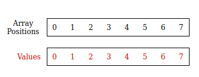
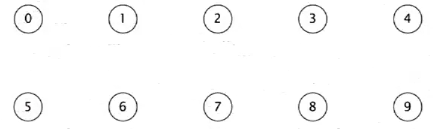
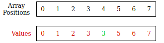
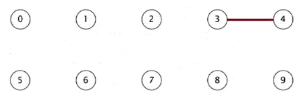
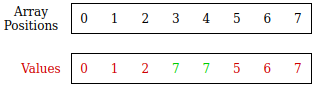
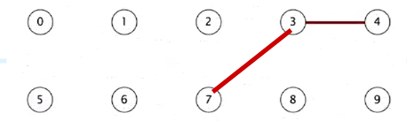

# Find Union Algorithm
1. [ Description ](#desc)
2. [ Why is this algorithm useful ](#desc)
3. [ Implementations ](#usage)


## Description
This algorithm is used to represent the nodes or points inside a
system along with their relationships.

## Use Cases
TODO: complete it!!!

---

# Simple Implementation

## Union Find Data Structure
The data type used to represent the nodes of this algorithm is an array where each position number of the array represents each node and the values of it represents the relationship between the nodes. Although the Union Find uses an array to store the information, the interpretation and managing we give to the array in this cases converts it into a totally different data structure: Union Find. 

;
> It represent Array once initialized.
> As we can see there's no relation between nodes yet

The image below shows the initialized nodes:

;
> This is the mental representation of how the nodes would look if they were outside the code

This state is equivalent to the first time we make an instance of the UnionFind Data Structure
```
  var fn = new FindUnion(10);
```
> The parameter passed through means how many nodes we expect the FindUnion DataStructure to have: 10 in this case.


## Union Method
The method union is used to establish a relationship between two different nodes in the array
```
  fn.union(4,3);
```
After its usage the state of our array will be altered expressing the first relation between two nodes.

;

An so it will be the case for our abstract representation:

;

Let's do another conection. In this case a connection between 3 and 7

```
  fn.union(3,7);
```

;

The result will be a connection between the points 3, 4, 7. As we can see all of them are connected by its value. Each of them have the same value indicating they're connected 

;

## Connected Method

This methods is used to check whether two nodes are connected or not. It returns a boolean type indicating its relation. 
* False: there's no relation
* True: there's a relation

Having the following state:

;

The following method will return a True
```
  fn.connected(3,7);
```

Meanwhile it will return False
```
  fn.connected(0,7);
```